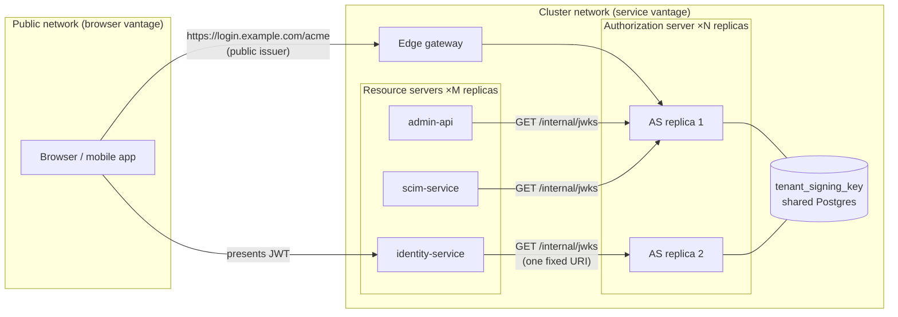
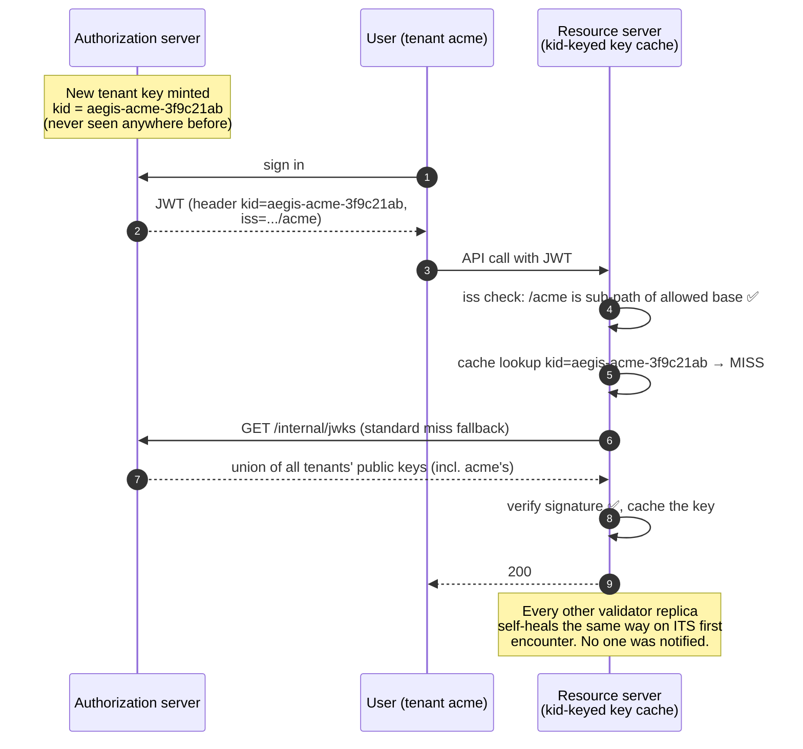
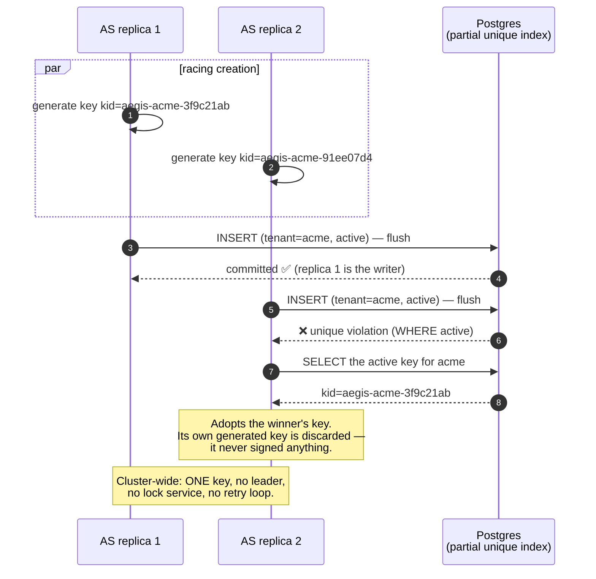
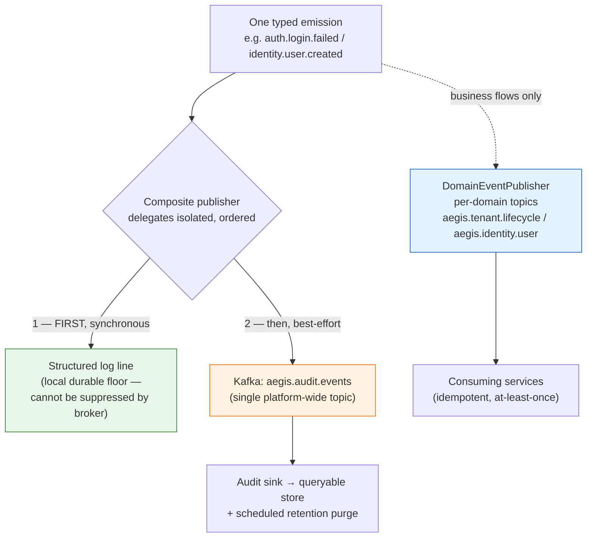
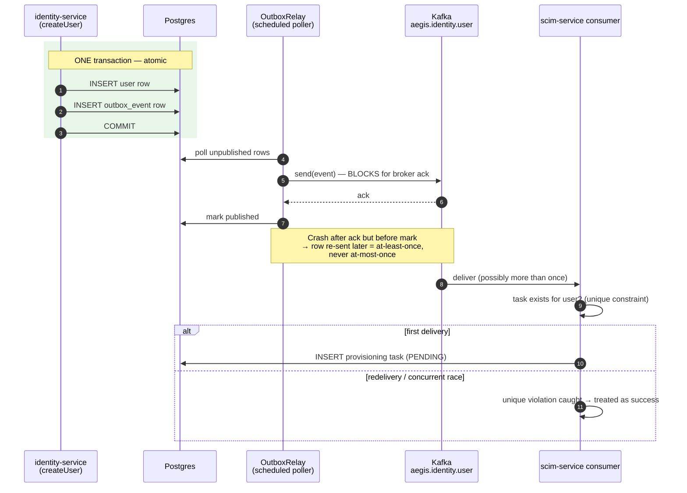
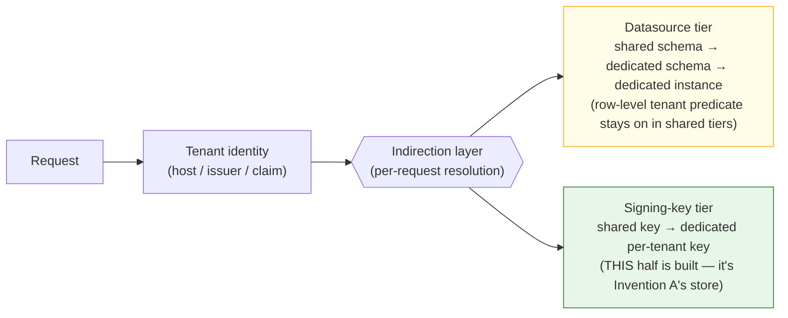

# The Aegis Inventions, Explained — a personal deep-dive

**CONFIDENTIAL — personal reference. Not part of the counsel package, but treat it with the same
secrecy: it describes the inventions in full, and publishing it would count as public disclosure.**

This is the "explain it to me properly" companion to `PATENT-INVENTION-DISCLOSURE.md`. The
disclosure is written for a patent attorney — terse, claim-shaped, defensive. This document is the
opposite: it walks through *why* each mechanism exists, what breaks without it, and how the pieces
lock together, with diagrams. The diagrams are also the working drafts of FIG. 1–6 for the filing.

---

## The one-paragraph version of each invention

- **Invention A (the strong one):** In a multi-tenant identity platform, every tenant has its own
  token-signing key, the same server is known by different hostnames from different places in the
  network, and everything is replicated. Normally that combination forces you to build a
  key-distribution/coordination system so all the validators stay in sync. Aegis doesn't build one.
  Instead, the *name* of each key (`kid`) is engineered so that any key change is automatically a
  cache miss on every validator, and the cache miss itself fetches the fix from one aggregate
  endpoint. Nobody notifies anybody, and the system cannot stay wrong.
- **Invention B:** One event emission is split into two fates — a compliance record that can't be
  lost even if Kafka is down, and a business event that reliably drives other services — and the
  business side picks its delivery machinery (cheap best-effort vs. heavyweight transactional
  outbox) by a crisp rule: *does the flow self-correct if the event is lost?*
- **Invention C:** One lookup — "which tenant is this request for?" — resolves *both* where the
  data lives *and* which cryptographic key signs the tokens, so a tenant can be promoted to a more
  isolated (premium) tier by changing data, not code. (Half built; the key half is real, the
  datasource half is design.)

---

# Part 1 — Invention A: keys that propagate themselves

## 1.1 The stage

Aegis is one authorization server (AS) serving many tenants, each with its own OIDC issuer
(`.../acme`, `.../globex`, …) and its own RSA signing key. Around it sit resource servers (RS) —
identity, admin, SCIM, tenant services — which validate the JWTs the AS mints. Everything runs
replicated behind load balancers.



Three independent problems collide here, and each one alone is annoying; together they're a
distributed-systems trap.

## 1.2 Problem one: the server has two names (split horizon)

A JWT carries an `iss` (issuer) claim — the URL of the server that minted it. But *which* URL? The
browser reached the AS at `https://login.example.com/acme`; the identity-service would reach the
same AS at `http://authorization-server:9000/acme`. Standard Spring resource-server config takes
**one** `issuer-uri` and derives everything from it (including where to fetch keys). Pick the
public one and the RS can't even resolve the hostname to fetch keys; pick the internal one and every
browser-minted token is rejected because its `iss` doesn't match. The failure is a bare `401` with
nothing in the logs — the classic Dockerized-OIDC trap.

**The move:** stop deriving key location from the issuer. Keys are always fetched from a fixed
in-network URI, and the issuer claim is checked against a small **allow-list** of the server's
known names. Two concerns that the standard config fuses — *"who minted this?"* and *"where are the
keys?"* — get separated.

## 1.3 Problem two: every tenant has its own key, and tenants appear at runtime

Per-tenant signing keys are the cryptographic isolation story: a token minted for tenant A is
mathematically un-forgeable for tenant B, even if application-level checks fail. But the standard
OIDC discovery contract is *per issuer*: `.../acme/oauth2/jwks` serves only acme's key. A resource
server would need one JWKS client per tenant — and tenants are created by API call at any moment.
Configuration that scales O(tenants × validators) is dead on arrival.

**The move (piece 1 — aggregate endpoint):** the AS additionally serves `/internal/jwks` — the
**union** of every tenant's active *public* key. One fixed URI answers "where are the keys?" for
all tenants, forever. The per-tenant JWKS endpoints stay untouched, so external standards-compliant
clients see nothing unusual — the aggregate is an extra projection of the same material, not a fork
of the protocol.

**The move (piece 2 — structural issuer acceptance):** the allow-list doesn't enumerate tenants.
An issuer is accepted if it equals an allowed base **or is a `/{tenant}` sub-path of one**:

| Presented `iss`                                | Allow-list `[https://login.example.com, http://authorization-server:9000]` |
|------------------------------------------------|------------------|
| `https://login.example.com`                    | ✅ exact match |
| `https://login.example.com/acme`               | ✅ sub-path of allowed base |
| `http://authorization-server:9000/globex`      | ✅ sub-path of allowed base |
| `https://evil.example.net/acme`                | ❌ no base matches |

Two config entries cover an unbounded, changing tenant population. Signature and expiry checks are
untouched — only the *hostname the token was minted behind* is treated flexibly.

## 1.4 Problem three: caches, replicas, and the missing coordinator

JWT validators cache verification keys, indexed by the token's `kid` header. So when a key
*changes* — a new tenant's first key, or a rotation — every cache in the fleet is momentarily
wrong. The textbook fixes are all **coordination**: broadcast a cache-bust, version the endpoint,
run a shared cache service, push config. Every one of them is a new component, a new failure mode,
and a new thing that can be down during the exact event (key change) it exists for.

And it's worse: the AS itself is replicated. Two replicas can simultaneously decide "tenant acme
has no key, I'll create one" — and mint *different* keys. Tokens signed by replica 1 then fail
against replica 2's key set. That's not a cache problem; that's split-brain at birth.

## 1.5 The heart of the invention: the `kid` does the coordinating

Here is the piece that makes the whole thing patent-worthy. Every JWKS-caching JWT library
(Nimbus, which Spring uses, and its peers) has one standard behavior: **when a token arrives with a
`kid` the cache doesn't recognize, re-fetch the key-set URI.** It's a fallback everyone has and
nobody thinks about.

Aegis engineers the key identifier so that this fallback *is* the entire propagation protocol. The
`kid` format is `aegis-<tenant>-<random suffix>`, with two properties in deliberate tension:

- **Stable while the key is unchanged.** Keys are durable (in Postgres, private halves
  envelope-encrypted), so a restart re-serves the same `kid` — caches stay warm. (Early versions
  regenerated keys per boot, which silently invalidated every outstanding token. Durability fixed
  that *and* made the stable-`kid` half possible.)
- **Globally unique across any creation or rotation.** The random suffix guarantees a
  never-before-seen `kid` whenever key material changes.

Combine those and you get an invariant: **a validator cache hit is always correct, and any key
change is a guaranteed cache miss on every validator — and the miss's built-in fallback fetches the
aggregate endpoint, which is guaranteed to contain the fix.** Propagation happens lazily, exactly
where and when a stale validator meets a new token. No broadcast. No pub/sub for keys. No shared
cache. Nothing extra to deploy, monitor, or have fail.



The elegant part is what's *absent*: there is no arrow in that diagram that says "notify". The
mechanism cannot be down, because it isn't a component — it's a naming discipline exploited through
behavior the validators already have.

## 1.6 The birth race: first-writer-wins in the database

Self-healing caches assume there's *one true key* to converge on. Making that true under replica
concurrency is piece 4. The key store carries a **partial unique index**:

```sql
CREATE UNIQUE INDEX uk_tenant_signing_key_one_active_per_tenant
    ON tenant_signing_key (tenant) WHERE active;
```

At most one **active** key per tenant — but any number of *retired* rows (that's why it must be
partial rather than `UNIQUE(tenant, active)`: rotation history is legal). Two AS replicas racing to
create acme's first key both generate and both insert; the index lets exactly one commit. The loser
doesn't retry, back off, or elect anything — it **catches the violation and adopts the winner's
key**. One round, guaranteed convergence.



Two subtle load-bearing details from the implementation:

- The insert runs in its **own transaction** (`REQUIRES_NEW`). The violation is *expected*, and in
  the caller's transaction it would mark everything rollback-only — making the recovery SELECT
  (the entire point) fail too. The seam of the transaction boundary is part of the mechanism.
- Reads come from a **30-second-TTL snapshot** so token signing never pays a DB query, and the
  staleness rule is asymmetric on purpose: a snapshot *hit* may be up to TTL stale (harmless — keys
  barely change), but a snapshot *miss always falls through to the store before generating*, so
  staleness can never cause a duplicate key. Cheap reads without reintroducing the race.

## 1.7 Remove one piece and watch it break

| Removed piece | What breaks |
|---|---|
| Aggregate `/internal/jwks` | The `kid`-miss re-fetch hits a per-issuer JWKS that lacks other tenants' keys → per-tenant validation gap returns; config goes O(tenants×validators). |
| Issuer allow-list w/ sub-path | Either browser-minted or service-minted tokens are rejected (split-horizon 401s), or tenant issuers must be enumerated per validator. |
| Unique-`kid` discipline | A rotation reuses/collides a `kid` → warm caches serve the *old* key for the new token → signature failures until TTL expiry; propagation now needs real coordination. |
| Durable store + partial index | Replicas mint divergent keys (split-brain); restarts invalidate all outstanding tokens; the "one true key" the caches converge on doesn't exist. |

That table is the §103 (non-obviousness) story in miniature: each piece is individually known;
the *combination* is what removes the coordination protocol, and no proper subset works.

**Analogy:** a hotel that never phones its doors. When a lock is re-keyed, the new keycard carries
a serial number no door has ever seen; a door seeing an unknown serial automatically consults the
one master list at the front desk, which always has the answer. Doors that never see the new card
never do any work. The re-keying *is* the announcement.

**Honest status:** key *creation* and propagation are fully built and test-verified. *Rotation* is
schema-ready (retired rows are legal; a rotated key's fresh `kid` would propagate identically) but
there is no rotate operation yet, and the aggregate serves active keys only — so the grace window
where a retired key still verifies old tokens is design, not code. The disclosure flags this.

---

# Part 2 — Invention B: one emission, two fates

## 2.1 The tension

Two consumers want your events, and they want opposite things:

| | Forensic / audit ("what happened?") | Business / integration ("make things happen") |
|---|---|---|
| Loss tolerance | **None** — a compliance record must survive broker outage | Depends on the flow (see 2.3) |
| Retention | Purged on a compliance schedule | Consumed and gone; purge would *lose work* |
| Consumers | Audit sink, SIEM, humans | Other services, acting on it |
| Coupling | Must never block or break the business | Is *part of* the business |

One stream forces one policy on both — wrong for at least one. Two fully separate emission systems
mean every service publishes twice and the two records drift. Aegis: **one producer-side emission,
split into two paths with independent fates.**

## 2.2 The forensic path: the floor is a local write



The ordering rule is the whole point: the log write happens **first and synchronously**, and each
delegate is wrapped so one failing cannot suppress the others. Kafka down? The floor already has
the record; the streamed copy is enrichment. This is CloudTrail's philosophy at the emission point:
the durable record must not depend on the pipeline's health.

## 2.3 The business path: the floor-vs-outbox rule

The producer-side guarantee is chosen per flow by one question — **"if this event is lost, does
the system still converge to the correct state?"** If yes, the flow has a *correctness floor* and
gets cheap best-effort publish. If no, it gets the transactional outbox.

Both cases are live in the codebase, which makes the contrast concrete:

- `tenant.created` → AS eagerly provisions the tenant's signing key. Lost event? The key is
  **lazily created on first login anyway** (Invention A's `loadOrCreate` *is* the floor). Best-effort
  is provably fine; outbox machinery here would be pure waste.
- `identity.user.created` → SCIM outbound provisioning. Lost event? **The user silently never
  provisions downstream — nothing ever re-derives it.** No floor → outbox, mandatory.



Why each arrow is where it is:

- **User row and outbox row in one transaction** kills the dual-write problem: there is no instant
  where the user exists but the promise-to-publish doesn't (or vice versa).
- **Mark-after-ack** deliberately chooses the safe side of the crash window. Crash between ack and
  mark → the row is sent again. Duplicates are recoverable; silent loss is not.
- **Consumer idempotency via a database unique constraint** (not consumer-side memory) finishes the
  guarantee: redelivery — even *concurrent* redelivery — collapses to one task, because the
  constraint violation is caught and treated as success. At-least-once + idempotent = effectively
  exactly-once *outcome*, with none of exactly-once's machinery.

The claim-worthy part isn't the outbox (well-known) — it's the **fate split from a single emission**
plus the **explicit floor-keyed selection rule** deciding which flows pay for the outbox at all.

---

# Part 3 — Invention C: promotion by data, not deploys



One tenant identity resolves *both* where data lives and which key signs — so moving a regulated
tenant to a premium isolation tier is a data change, zero code. Honest status: the cryptographic
half is real (Invention A's per-tenant key resolution); the datasource-routing half is architecture-
document design with **no code yet**. In the filing it's a dependent claim/embodiment unless built
first — which is also why it's third in priority.

---

# Part 4 — The patent side, in plain English

- **Why §101/*Alice* dominates everything.** US courts void software patents that claim an
  "abstract idea" done on a computer. "A method of authenticating users per tenant" dies instantly.
  What survives is a *specific technical mechanism improving how computers/networks function* —
  which is why the disclosure leads every invention with a technical failure mode it eliminates
  (coordination-free propagation, loss-proof records under partial failure), never a business
  benefit.
- **Why a provisional first.** ~Hundreds of dollars in fees, no claims required, establishes a
  priority date, buys 12 months to decide. The US is first-to-*file*: the date matters more than
  the polish. Convert to a non-provisional only if the prior-art search says Invention A survives.
- **Why the prior-art search is non-negotiable.** Every *piece* here is known (JWKS, allow-lists,
  outbox, partial indexes). The application stands only on the *combinations*, so counsel must
  search precisely those combinations — the disclosure hands them the exact queries and the
  adjacent art to distinguish (Keycloak, Auth0 custom domains, Debezium).
- **Why silence until filing.** Public disclosure before the priority date starts a 12-month US
  grace clock and **kills EU/China rights outright** (no grace period there). That includes blog
  posts, conference demos, publicly hosting the platform, and — pointedly — publishing documents
  like this one to any web host. Keep everything in the private repos.
- **Inventorship is legal, not honorary.** Counsel determines it from who conceived each mechanism;
  git history in the private repos is the record. Wrong inventorship can invalidate everything.

---

## Glossary

| Term | Meaning |
|---|---|
| `iss` / issuer | JWT claim naming the server (URL) that minted the token. |
| JWKS | JSON Web Key Set — a JSON document of public keys, fetched by validators over HTTP. |
| `kid` | Key ID — JWT header naming which key signed it; validators index their key caches by it. |
| Split horizon | The same server known by different hostnames from different network vantage points. |
| Partial unique index | A uniqueness rule applied only to rows matching a condition (`WHERE active`). |
| Correctness floor | An independent mechanism that converges the system to the right state even if an event is lost. |
| Transactional outbox | Staging an event in the same DB transaction as the state change; a relay publishes it afterwards. |
| At-least-once | Delivery may duplicate but never silently drop; paired with idempotent consumers. |
| Provisional application | Cheap unexamined filing that fixes a priority date for 12 months. |
| §101 / *Alice* | The US eligibility doctrine excluding "abstract ideas"; the main killer of software patents. |
