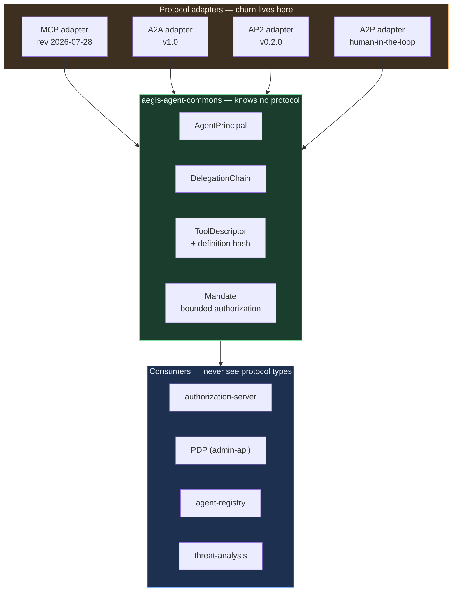
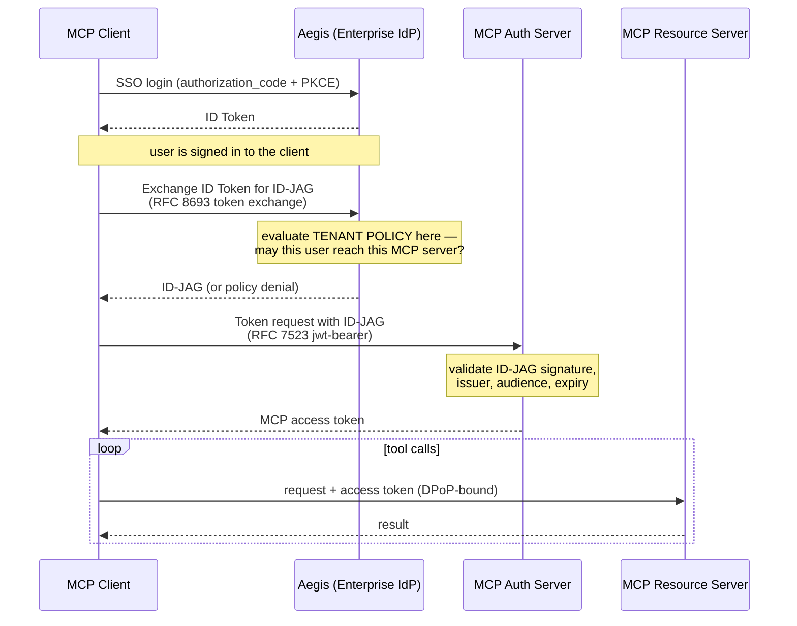
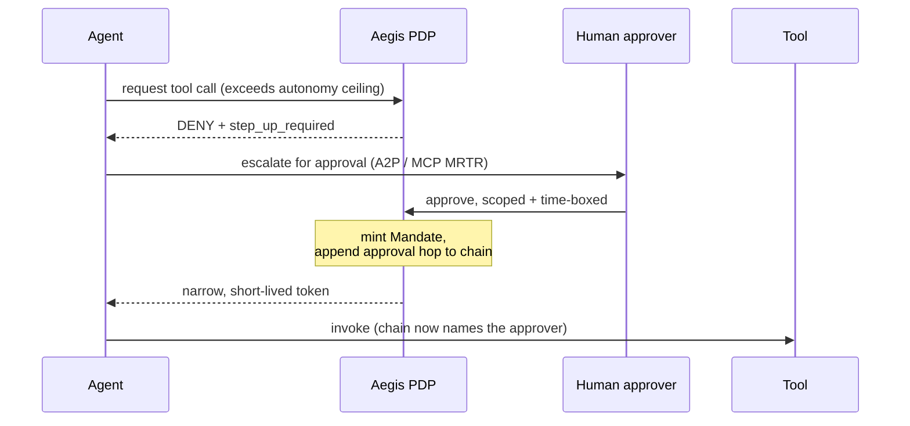
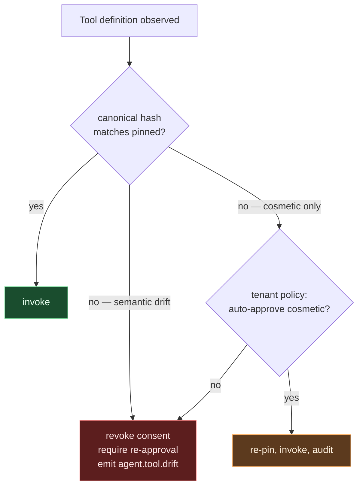

# Aegis — AI Agent Identity & Threat Analysis Architecture

> **Status:** specification (SDD). Written 2026-08-26, ahead of implementation, per the platform's
> spec-driven / test-driven workflow. Companion to
> [`ARCHITECTURE.md`](ARCHITECTURE.md) §1.1 (scope reopened 2026-08-26) and ADR-0010 … ADR-0017.
>
> **Framework- and SDK-agnostic by construction.** Nothing in the core model names LangChain,
> Strands, ADK, Bedrock AgentCore, OpenAI Agents, Semantic Kernel or any other toolkit. Agents built
> on any of them are the same kind of principal to this platform.

---

## 1. Why agents break the model the platform already has

Aegis today knows two kinds of principal: a **human**, who authenticates interactively and holds a
session, and a **service client**, which holds long-lived credentials and acts only as itself.
An AI agent is neither, and the differences are structural rather than cosmetic.

| Property | Human | Service client | **AI agent** |
|---|---|---|---|
| Authority origin | own | own | **delegated from a human or another agent** |
| Authority depth | 1 hop | 1 hop | **N hops, discovered at runtime** |
| Action rate | ~1/sec | steady, predictable | **hundreds/min, bursty** |
| Action set | fixed by UI | fixed at deploy | **open-ended; tools discovered at runtime** |
| Instruction source | the person | the code | **attacker-influenceable content** |
| Lifetime | session | years | **seconds to minutes** |

The last two rows are why this is a security problem and not merely a modelling exercise. An agent
reads untrusted content *inside the same context that holds its credentials*, so the classic
separation between "the code that decides" and "the data being processed" collapses. And because its
tool set is discovered at runtime, no static grant can enumerate what it will actually do.

### 1.1 The three questions the current platform cannot answer

1. **"On whose authority?"** — `AuditEvent` has a single `actor` field. The chain
   *human → agent → sub-agent → tool → resource* cannot be written down, so it cannot be authorized
   on or alerted on. This is the structural blocker; everything else is downstream. (ADR-0010)
2. **"Is this still the tool that was approved?"** — consent is scope-granular. A tool's description
   *is* the model's instruction surface, so a server can change a tool's meaning without changing its
   name or its scope. (ADR-0013)
3. **"Is this behaviour normal for this agent?"** — there is no behavioural baseline, and the human
   heuristics the industry ships (impossible travel, login cadence) are meaningless at machine speed.
   (ADR-0014)

---

## 2. The delegation chain — the spine of the design

Everything in this document rests on one construct: an ordered, cryptographically-attested record of
who authorized whom, to do what, within what bounds.

```mermaid
flowchart LR
    H["Human<br/>sub = user:alice@acme"]
    A1["Orchestrator agent<br/>act[0] = agent:planner"]
    A2["Sub-agent<br/>act[1] = agent:researcher"]
    T["Tool invocation<br/>mcp:files/read@sha256:9f2c…"]
    R["Resource<br/>acme-docs bucket"]

    H -->|"authorizes<br/>(consent + mandate)"| A1
    A1 -->|"RFC 8693 exchange<br/>audience narrowed"| A2
    A2 -->|"tool call<br/>DPoP-bound"| T
    T --> R

    style H fill:#1a4d2e,stroke:#7fe0a0,color:#e8fff0
    style A1 fill:#1e3a5f,stroke:#7fb3ff,color:#e8f2ff
    style A2 fill:#1e3a5f,stroke:#7fb3ff,color:#e8f2ff
    style T fill:#5c3a1e,stroke:#ffb870,color:#fff2e0
    style R fill:#3d2a4d,stroke:#c99fff,color:#f5ecff
```



**The invariant, borrowed directly from RFC 8693:** the **subject never changes** while the **actor
chain grows**. At every hop `sub` remains `user:alice@acme`; each exchange appends a nested `act`
claim. This is what makes the chain useful for both authorization and forensics — the root
accountable party is always one field lookup away, no matter how deep the delegation went.

### 2.1 Token shape

```jsonc
{
  "iss": "https://login.acme.com/t/acme",
  "sub": "user:alice@acme",              // ← never changes down the chain
  "aud": "https://mcp.acme.com/files",   // ← narrowed at every hop (RFC 8707)
  "cnf": { "jkt": "0ZcOCORZNYy…" },      // ← sender-constrained (ADR-0017)
  "act": {                                // ← nearest actor, outermost
    "sub": "agent:researcher",
    "act": { "sub": "agent:planner" }     // ← nested: the hop before it
  },
  "may_act": { "sub": "agent:planner" },  // ← who may exchange this token onward
  "aegis:tool": "mcp:files/read@sha256:9f2c…",   // pinned tool identity (ADR-0013)
  "aegis:envelope": "task:20260826-7f3a",        // declared task envelope
  "scope": "files:read"
}
```

### 2.2 Audit shape — additive, because the schema is a customer contract

`AuditEvent`'s javadoc states records are "streamed to customer SIEMs." That makes it a public
contract: **additive changes only** (ADR-0010). `actor` keeps its exact current meaning — the
effective, last-hop actor — so every existing SIEM parser continues to work untouched.

```java
// existing fields unchanged: type, action, outcome, tenantId, actor, target, correlationId, at, attributes
// added, all optional:
String onBehalfOf;              // root subject — "user:alice@acme"
List<DelegationHop> chain;      // ordered, nearest-last
String agentInstanceId;         // this run of this agent
String toolInvocationId;        // correlates request/result/error for one tool call
```

---

## 3. Protocol-agnostic core, protocol-specific adapters

The protocol landscape is moving faster than any release cycle can track. In roughly twelve months:
MCP reached revision `2026-07-28` and **deprecated** Dynamic Client Registration in favour of Client
ID Metadata Documents; A2A hit 1.0 and added signed Agent Cards; AP2 shipped 0.2.0. Binding the
identity model to any one of them guarantees a rewrite (ADR-0011).



### 3.1 MCP — Model Context Protocol (revision `2026-07-28`)

MCP is *agent → tool*. The MCP server is simultaneously an OAuth 2.1 **resource server** and a
**client** to its own downstream dependencies, which is precisely what makes the confused-deputy
problem acute.

What the current revision requires, and what Aegis must therefore do:

| Spec requirement | Aegis obligation |
|---|---|
| Clients **MUST** send RFC 8707 `resource` on authorize + token requests | AS honours `resource`, narrows `aud` to it |
| Servers **MUST** implement RFC 9728 Protected Resource Metadata | Publish `/.well-known/oauth-protected-resource` per MCP resource |
| Servers **MUST** validate they are the intended audience | Resource-server filter rejects mismatched `aud` |
| Servers **MUST NOT** accept or transit foreign tokens | Token pass-through is a build-breaking test failure |
| AS **SHOULD** return `iss` (RFC 9207); clients **MUST** validate | Emit `iss`, advertise `authorization_response_iss_parameter_supported` |
| DCR **deprecated** → Client ID Metadata Documents | Implement CIMD first; DCR only for back-compat |
| Method/tool names in `Mcp-Method` / `Mcp-Name` **headers** | `edge-gateway` authorizes without parsing bodies |

**Enterprise-Managed Authorization** is the highest-leverage single item in this document. It is a
*stable* MCP extension already adopted by Okta, Microsoft Entra and Auth0 — the surface on which
enterprise agent deals are currently decided.



The decisive property: **policy is evaluated at the IdP, before any token exists**, and the user is
never redirected to the MCP server's own consent screen. Revoking an employee's access to every MCP
server in the estate becomes one control-plane action instead of N per-server revocations.

Aegis plays **both** roles — enterprise IdP issuing ID-JAGs, and MCP Authorization Server redeeming
them — because tenants will need each independently.

### 3.2 A2A — Agent2Agent (v1.0, Linux Foundation)

A2A is *agent → agent*, across organizational boundaries. Agents publish **Agent Cards**: JSON
documents advertising capabilities, endpoints and accepted auth schemes.

The security gap A2A leaves open, deliberately, is that it **delegates credential management entirely
to implementers** — it does not mandate how an Agent Card is verified. That is exactly an identity
platform's job:

- **Card verification** — Aegis verifies signed Agent Cards against a per-tenant trust store; an
  unsigned or untrusted card yields a principal with **zero** authority, never a default-allow.
- **Card pinning** — a card's capability set is content-hashed on the same principle as tool
  definitions (ADR-0013), so a peer silently broadening its own advertised capabilities is detectable.
- **Cross-org chain preservation** — when a chain crosses an organizational boundary, the outbound
  token carries the chain but the *foreign* tenant's identifiers are namespaced and never conflated
  with local ones.
- **Inbound chains are claims, not facts** — a delegation chain asserted by an external agent is
  attested evidence about *their* side of the boundary. It is recorded, and it is never treated as
  locally-issued authority.

### 3.3 AP2 — Agent Payments Protocol (v0.2.0), and A2P more broadly

> **Assumption, stated openly:** "A2P" was ambiguous in the request. This document covers **both**
> readings, because they share one spine — *bounded, cryptographically-proven human authorization of
> an agent action*. If only one was meant, the other is still coherent and costs nothing to keep.

**AP2 — Agent-to-Payment.** AP2's central construct is the **Mandate**: a signed authorization
binding an agent's spending authority to constraints — amount ceiling, merchant category, time
window, single-use vs. recurring. Crucially, *the mandate is bound to the user's signing key, not the
agent's*, and the agent never sees the payment credential.

That construct generalizes well beyond payments, and Aegis models it as such — `Mandate` is a core
type (ADR-0011), not a payments type:

```
Mandate {
  subject         user:alice@acme        // who authorized (holds the signing key)
  grantee         agent:shopper          // who may act
  constraints     { limit, category, window, useCount }
  proof           signature over the canonical form
}
```

A spending cap is one constraint vocabulary. A "may call at most 50 tools, only from this
allow-list, only within this task envelope, expiring in 10 minutes" ceiling is another, expressed in
the identical structure. The platform verifies mandates; it does not process payments.

**A2P — Agent-to-Person.** The human-in-the-loop path: an agent reaching a decision it is not
authorized to take alone and escalating to a person. MCP's 2026-07-28 revision added **Multi
Round-Trip Requests** for exactly this — a tool returns `resultType: "input_required"` mid-execution
and the client retries with the human's response attached. Aegis's role is to make that approval
*attributable*: the approval is itself a delegation hop, signed and appended to the chain, so the
audit record shows precisely which human unblocked which action and when.



---

## 4. Tool identity and consent

A tool's description is the instruction surface the model reads. Rename nothing, change the
description, and the tool now means something else — the **rug-pull / tool-poisoning** class.

Tool identity is therefore the triple `(server_id, tool_name, definition_hash)`, where the hash
covers only *semantically meaningful* fields — name, description, input schema — and deliberately
excludes cosmetic ones such as display titles and icons.



This is why the existing `JdbcOAuth2AuthorizationConsentService` is insufficient rather than merely
inconvenient: scopes cannot express "I approved *this version*."

---

## 5. Threat analysis — sequence-shaped, and honestly post-hoc

### 5.1 Agent-specific STRIDE additions

| Threat | Agent-specific form | Control |
|---|---|---|
| **S**poofing | Unsigned/forged A2A Agent Card; agent impersonating its principal | Signed cards + per-tenant trust store (§3.2); `sub` immutable through exchange |
| **T**ampering | Tool definition changed post-approval (rug pull) | Content-addressed tool identity (ADR-0013) |
| **R**epudiation | "The agent did it" with no attributable human | Delegation chain with root `onBehalfOf` (ADR-0010) |
| **I**nfo disclosure | Prompt injection exfiltrating a bearer token via a legitimate tool call | DPoP sender-constraining (ADR-0017); audience narrowing |
| **D**oS | Runaway agent loop exhausting tenant quota or spend | Per-agent-instance quotas at the edge; mandate constraints |
| **E**oP | Delegation laundering — chain acquiring scopes the root subject never held | Monotonic scope narrowing, enforced at every exchange |

**Delegation laundering** deserves emphasis: it is the agent-native privilege-escalation primitive.
Agent A (low privilege) delegates to agent B (high privilege) and receives back a result it could
never have obtained directly. The invariant that defeats it — **scope may only narrow, never widen,
along a chain** — is enforced at the exchange, and any violation is both refused and alerted.

### 5.2 Why human heuristics are the wrong tool

Impossible travel, login cadence and device fingerprinting are all meaningless for a principal that
legitimately makes 400 calls a minute from a datacentre IP. Useful agent signals are **sequence**
signals:

- **tool-call entropy** — sudden broadening of the tool distribution
- **high-risk pairings** — `read-credentials → external-network-write`; *neither call alone is
  suspicious*, the adjacency is the signal
- **chain depth / autonomy drift** — delegation deepening beyond an agent's historical envelope
- **task-envelope deviation** — declared "summarize this document", now enumerating buckets
- **scope-narrowing violations** — see laundering, above

### 5.3 Placement: never on the auth path

Detection consumes `aegis.audit.events` asynchronously and **never** sits inline with token issuance
(ADR-0014). The honest consequence, stated rather than glossed: **detection cannot block the first
bad call.** Prevention is the PDP's job and the gateway's; detection's job is fast revocation and
blast-radius limitation. Anyone who mistakes the second for the first will build the wrong thing.

### 5.4 The collision with "audit events must never carry secrets"

The platform's standing non-negotiable is that audit events never carry secrets. Threat analysis
wants tool arguments and results — which is exactly where credentials leak. These genuinely conflict,
so the resolution is architectural rather than a matter of care:

- The audit topic carries **canonical fingerprints** — `sha256(canonical(args))`, argument *shapes*,
  types, sizes and counts — never raw values.
- Redaction happens **at the boundary**, in the adapter, before an event object is constructed.
  Nothing downstream can leak what was never in the record.
- Detectors are built to work on fingerprints. A detector that would need raw values is a detector we
  do not ship.

Fingerprints are sufficient for the signals that matter: repetition, drift and adjacency are all
detectable without ever seeing plaintext.

---

## 6. Per-tenant agent policy

Tenancy is the base of the platform, so every agent control is per tenant (`tenant-service`):

```yaml
agentPolicy:
  autonomyCeiling: SUPERVISED        # AUTONOMOUS | SUPERVISED | CONFIRM_EACH
  maxDelegationDepth: 3
  maxToolCallsPerTask: 50
  toolAllowList: ["mcp:files/read", "mcp:search/*"]
  toolDenyList:  ["mcp:shell/*"]
  requireSignedAgentCards: true      # A2A
  cosmeticDriftAutoApprove: false    # ADR-0013
  senderConstrained: REQUIRED        # ADR-0017
  mandate:
    required: true
    maxWindow: PT10M
```

---

## 7. Build status

Per the platform's honesty convention (`ARCHITECTURE.md` §1.3), status is stated plainly.

| Component | Status |
|---|---|
| ADR-0010 … ADR-0017 | **Accepted** — this document's decisions are recorded |
| Scope reopening (§1.2) | **Done** |
| Delegation chain in `aegis-audit-commons` | see repo — TDD, tests first |
| `aegis-agent-commons` core model + adapters | see repo — TDD, tests first |
| RFC 8693 exchange (SAS-native) | SAS 7.1.0 ships `OAuth2TokenExchangeAuthenticationProvider` |
| RFC 7523 `jwt-bearer` / ID-JAG | **not in SAS 7.1.0** — ours to build |
| `agent-registry-service`, `threat-analysis-service` | new services |
| Detection models | heuristics first; ML explicitly later |

**Two dependencies that make this weaker if left undone,** stated so they are not discovered late:

1. **mTLS east-west / workload identity is still "not started"** (deferred-capabilities roadmap item
   4). Asserting agent identity in tokens while the transport cannot prove which workload is speaking
   is a real gap. ADR-0015's Vault PKI engine is the unblock.
2. **The authorization-server is not horizontally scalable** — signing keys, sessions and interaction
   codes are in-process while Helm runs 2–8 replicas with no affinity. MCP's 2026-07-28 revision made
   the protocol core **stateless specifically so any request can land on any instance behind a
   round-robin load balancer**. Agent traffic is precisely the high-volume, load-balanced pattern
   that will expose this. Vault-backed signing (ADR-0015) removes the key half of the problem; the
   session half remains.

---

## 8. References

- MCP specification, revision `2026-07-28` — <https://modelcontextprotocol.io/specification/2026-07-28/basic/authorization>
- MCP Enterprise-Managed Authorization — <https://modelcontextprotocol.io/extensions/auth/enterprise-managed-authorization>
- A2A (Agent2Agent), Linux Foundation — <https://github.com/a2aproject/A2A>
- AP2 (Agent Payments Protocol) — <https://ap2-protocol.org/>
- RFC 8693 OAuth 2.0 Token Exchange · RFC 8707 Resource Indicators · RFC 9728 Protected Resource
  Metadata · RFC 9207 Issuer Identification · RFC 7523 JWT Profile · RFC 9449 DPoP
- NSA/CISA, *MCP Security Design* — <https://media.defense.gov/2026/Jun/02/2003943289/-1/-1/0/CSI_MCP_SECURITY.PDF>
