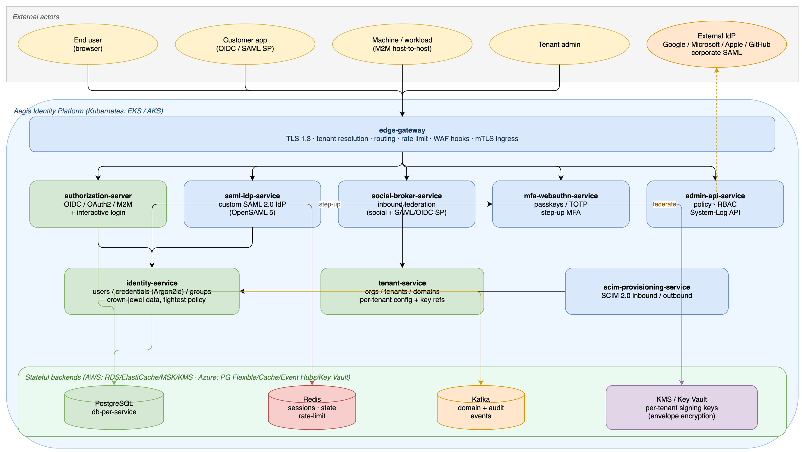
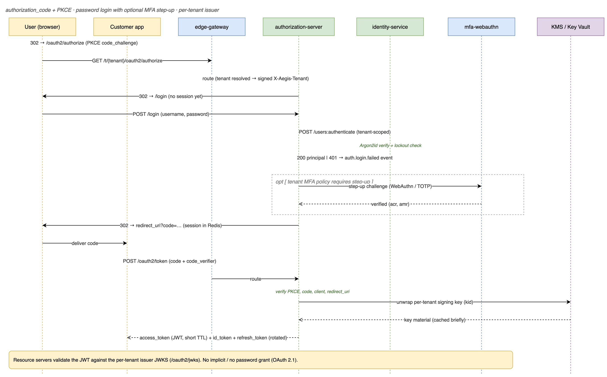
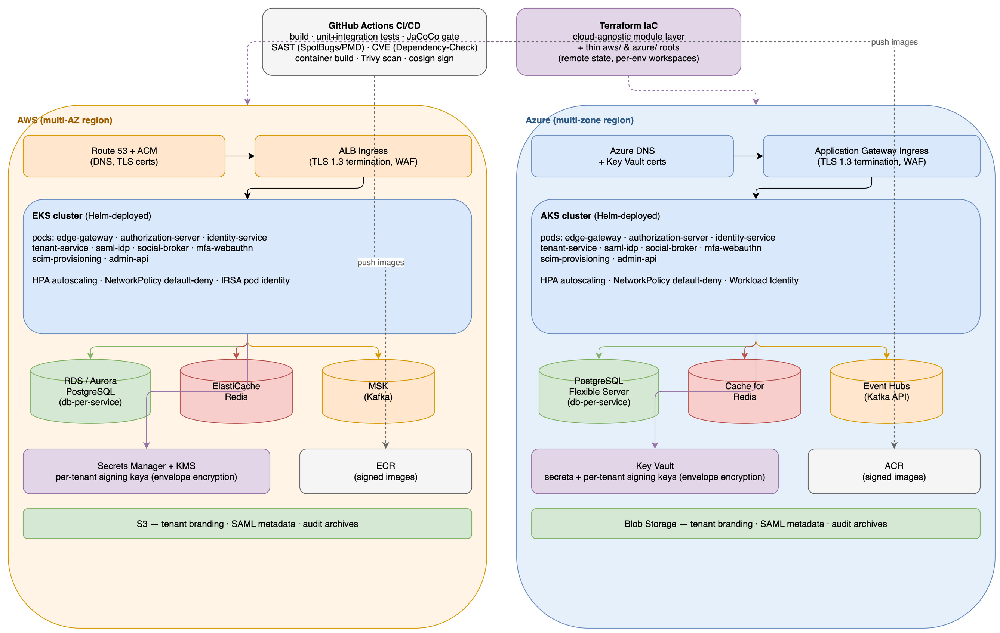

# Aegis Identity Platform — Architecture Specification

> **Status:** Living document · **Version:** 0.1 (foundation) · **Last updated:** 2026-07-13
> **Brand note:** "Aegis" and the `io.aegis` group id are placeholders. They are isolated to
> Maven coordinates, the `io.aegis` Java root package, and Kubernetes namespaces so a rename is a
> mechanical find/replace, not a refactor.

Aegis is a **multi-tenant, SaaS Identity & Access Management platform** — an Okta-class hosted
identity provider. It authenticates humans and machines, federates to external identity providers,
issues standards-based tokens (OIDC/OAuth2, SAML), and gives each customer (tenant) an isolated
directory, policy set, and branding.

This document is the **authoritative architecture spec**. Every service repo links back here. It is
deliberately technology-specific (Spring Boot 4.1 / Spring Security 7, Java 21, PostgreSQL, Redis,
Kafka, Kubernetes) because those choices have already been made and verified against live tooling.

---

## 1. Scope

### 1.1 In scope (platform capabilities)

| Capability | Okta analogue | Owning service(s) |
|---|---|---|
| OAuth2 / OIDC provider (authorization_code + PKCE, client_credentials, refresh, device) | Okta OIDC | `authorization-server` |
| Machine-to-machine / host-to-host auth (client credentials, mTLS, SPIFFE-style workload id) | Okta API Access Management | `authorization-server` + `edge-gateway` |
| Password / primary-factor authentication (login at *our* page during code flow) | Okta sign-in | `authorization-server` (login) + `identity-service` (credential store) |
| WebAuthn / passkeys (passwordless + step-up MFA) | Okta FastPass / WebAuthn | `mfa-webauthn-service` |
| SAML 2.0 **Identity Provider** (we assert to downstream apps) | Okta as SAML IdP | `saml-idp-service` (custom, OpenSAML 5) |
| Inbound federation (login with Google/Microsoft/Apple/GitHub, or a corporate SAML/OIDC IdP) | Okta Social + Inbound SAML | `social-broker-service` |
| Universal directory (users, groups, profiles, lifecycle) | Okta Universal Directory | `identity-service` |
| Multi-tenancy / organizations / custom domains | Okta orgs & tenants | `tenant-service` |
| SCIM 2.0 provisioning (in/outbound) | Okta Lifecycle Management | `scim-provisioning-service` |
| Admin & management API + console backend | Okta Admin | `admin-api-service` |
| Edge routing, tenant resolution, rate limiting, WAF hooks | Okta edge | `edge-gateway` |

### 1.2 Explicitly out of scope (for now — stated so nobody assumes otherwise)

- End-user and admin **web UIs** (React/Angular front-ends). This platform delivers the **backend
  APIs and standards endpoints**; login pages ship as minimal server-rendered Thymeleaf for the
  authorization-server only, flagged as reference UI to be replaced.
- **On-prem LDAP/AD agent** (Okta AD Agent). Direct LDAP/AD *bind* auth is supported in-cluster; a
  customer-premises sync agent is a later program.
- Adaptive/risk-based auth ML, Workflows/automation engine, API gateway product — later phases.

### 1.3 Honesty statement on "no pen-test findings / zero vulnerabilities"

No system can be *proven* to have zero vulnerabilities, and any engineer who promises a clean pen
test unconditionally is overselling. What this architecture commits to instead is **defense in depth
built to current best practice**: OAuth 2.1-aligned flows (no implicit, no ROPC), default-deny
authorization, tenant isolation enforced at the data layer, short-lived signed tokens with key
rotation, secrets in a managed vault, automated SAST/DAST/dependency-CVE scanning in CI, and a
maintained threat model (see `THREAT-MODEL.md`). That posture is what makes a pen test *boring*; it
is not a guarantee of zero findings. Residual risk is tracked, not denied.

---

## 2. Design principles

1. **Standards over cleverness.** OIDC, OAuth 2.1, SAML 2.0, SCIM 2.0, WebAuthn/FIDO2. If a behaviour
   isn't in a spec, question it.
2. **Default-deny everywhere.** Every filter chain ends in `anyRequest().authenticated()`; every
   query is tenant-scoped; every new endpoint is denied until explicitly permitted.
3. **Tenant isolation is a security boundary, not a feature.** A cross-tenant data leak is a Sev-1.
   Isolation is enforced in the persistence layer (row-level tenant predicate + defense-in-depth
   checks), not just in application code.
4. **Distributed, independently deployable, independently scalable.** Each capability is its own
   service, its own repo, its own database, its own release cadence. No shared mutable database.
5. **Stateless services, stateful stores.** Services hold no session state locally; sessions,
   caches, and coordination live in Redis so any pod can serve any request.
6. **Short-lived credentials.** Access tokens minutes, not hours. Refresh tokens rotated. Signing
   keys rotated with overlap. mTLS certs auto-renewed.
7. **Everything observable.** Structured JSON logs with tenant + correlation id, OpenTelemetry
   traces, auth-event stream to Kafka for audit and SIEM.
8. **Spec-first, test-first.** An endpoint's OpenAPI/contract and its failing test exist before its
   implementation. Security rules ship with a test that proves the rule (and a test that proves the
   *negative* — that the unauthorized case is actually rejected).

---

## 3. Service decomposition



> **Figure 1 — System context & service decomposition.**
> [PNG](diagrams/system-context.drawio.png) · [PDF](diagrams/system-context.drawio.pdf) ·
> [editable .drawio source](diagrams/system-context.drawio) (the PNG/PDF embed the editable XML).

Twelve deployable units. Each is an independent git repository (polyrepo) inheriting a shared
`aegis-platform-bom` parent and consuming shared `aegis-platform-commons` libraries as versioned
artifacts.

```
                         ┌──────────────────────────────────────┐
   Internet / browsers   │            edge-gateway              │  Spring Cloud Gateway
   & API clients ───────▶│  TLS, tenant resolution, routing,    │  (reactive)
                         │  rate-limit, WAF hooks, mTLS ingress │
                         └───────┬───────────────┬──────────────┘
                                 │               │
        ┌────────────────────────┼───────────────┼─────────────────────────┐
        ▼                        ▼               ▼                          ▼
 ┌──────────────┐   ┌────────────────────┐  ┌──────────────┐   ┌───────────────────┐
 │authorization │   │  saml-idp-service  │  │social-broker │   │ mfa-webauthn      │
 │  -server     │   │ (OpenSAML 5 custom │  │ (inbound     │   │  -service         │
 │ OIDC/OAuth2/ │   │  SAML 2.0 IdP)     │  │  fed: social │   │ passkeys / TOTP / │
 │ M2M / login  │   │                    │  │  + SAML SP)  │   │ step-up MFA       │
 └──────┬───────┘   └─────────┬──────────┘  └──────┬───────┘   └─────────┬─────────┘
        │                     │                    │                     │
        └──────────┬──────────┴──────────┬─────────┴──────────┬──────────┘
                   ▼                      ▼                    ▼
          ┌─────────────────┐   ┌──────────────────┐  ┌────────────────────┐
          │ identity-service│   │  tenant-service  │  │ scim-provisioning  │
          │ users/creds/    │   │ orgs/tenants/    │  │  -service          │
          │ groups          │   │ domains/config   │  │ SCIM 2.0 in/out    │
          └─────────────────┘   └──────────────────┘  └────────────────────┘
                   ▲                      ▲                    ▲
                   └──────────┬───────────┴─────────┬──────────┘
                              ▼                      ▼
                     ┌─────────────────┐   ┌──────────────────┐
                     │ admin-api-      │   │  (Kafka bus)     │
                     │  service        │   │  auth + lifecycle│
                     │ mgmt/console API│   │  + audit events  │
                     └─────────────────┘   └──────────────────┘
```

Full responsibilities, APIs, and datastore per service: see **`SERVICE-CATALOG.md`**.

### 3.1 Why these boundaries (and not a monolith)

- **Different scaling and blast radius.** The token endpoint (`authorization-server`) takes orders of
  magnitude more traffic than the admin API and must never be taken down by an admin-side bug.
  Separating them lets each scale and fail independently.
- **Different security surfaces.** The SAML IdP parses attacker-influenced XML (a notorious
  vulnerability class: XXE, signature-wrapping, DEFLATE bombs). Isolating it in its own process and
  network policy means a compromise there does not sit in the same address space as the password
  store.
- **Different release cadence and ownership.** WebAuthn is young and will change often; SCIM is
  stable. Coupling them forces the stable thing to redeploy for the volatile thing's churn.
- **Regulatory data separation.** Credentials (`identity-service`) are the crown jewels and get the
  tightest network policy, encryption, and audit; tenant metadata does not need that treatment.

### 3.2 What is deliberately *shared* (and why that's safe)

Shared **code** (via `aegis-platform-commons` libraries), never a shared **database**:
`security-commons` (baseline filter chains, resource-server config, hardening headers),
`tenant-context` (tenant resolution + propagation), `web-commons` (error model, correlation ids),
`audit-commons` (audit event schema + Kafka publisher), `testing-support` (Testcontainers bases).
Sharing config-as-code guarantees every service applies the *same* hardening; a shared DB would
couple release cycles and break tenant isolation — so that is forbidden.

---

## 4. Data architecture

### 4.1 Database-per-service (no shared schema)

Each stateful service owns a **private PostgreSQL database**. Services never reach into each other's
tables; they call APIs or consume events. Rationale: independent evolution, independent scaling,
independent failure, and a clean tenant-isolation boundary per service.

| Service | Primary store | Why |
|---|---|---|
| `tenant-service` | PostgreSQL | Strongly relational (orgs → domains → configs), low write volume, needs ACID. |
| `identity-service` | PostgreSQL | Users/credentials/groups — relational, ACID, must be transactionally correct (password change + audit). Credentials column encrypted at rest (Argon2id hash + envelope encryption via KMS). |
| `authorization-server` | PostgreSQL + Redis | JPA for registered clients, authorizations, consents (Spring AS ships the schemas). Redis for the authorization-request/consent short-lived state, JWKS cache, and token-revocation lists. |
| `saml-idp-service` | PostgreSQL | SP registrations, per-tenant IdP signing certs (KMS-wrapped), assertion audit. |
| `social-broker-service` | PostgreSQL + Redis | External IdP registrations + identity-link table; Redis for OAuth `state`/`nonce`/PKCE transient store. |
| `mfa-webauthn-service` | PostgreSQL | WebAuthn credential table (public keys + **sign counters**, updated every assertion) and TOTP secrets (encrypted). Custom schema — Spring ships none. |
| `scim-provisioning-service` | PostgreSQL | Provisioning jobs, connector config, mapping rules. |
| `admin-api-service` | PostgreSQL | Policies, admin RBAC, API tokens, tenant admin settings. |
| `edge-gateway` | Redis only | Stateless; Redis for distributed rate-limit buckets + tenant-routing cache. |

### 4.2 Why PostgreSQL as the system-of-record

Relational integrity is the whole game for identity data (a user *belongs to* a tenant, *has* many
credentials, *is in* many groups; a client *is registered to* a tenant). We need ACID transactions
(password rotation must be atomic with its audit record), row-level security potential, mature
encryption, JSONB for flexible per-tenant profile schemas, and first-class managed offerings on both
target clouds (AWS RDS/Aurora PostgreSQL, Azure Database for PostgreSQL Flexible Server). A document
store would push referential integrity and tenant-isolation enforcement into application code — the
opposite of what a security platform wants.

### 4.3 Why Redis

- **Sessions** for the authorization-server login (Spring Session + Redis) so any pod serves any
  login — no sticky sessions.
- **Transient protocol state**: OAuth `state`/`nonce`/PKCE verifiers, SAML `RelayState`, WebAuthn
  challenges — short TTL, high churn, must be shared across pods, must expire automatically.
- **Token/consent revocation lists & JWKS cache**: fast negative lookups on every resource-server
  call path.
- **Distributed rate limiting** at the edge and on password/OTP endpoints (brute-force defense).

### 4.4 Why Kafka (event backbone)

Services stay decoupled by publishing **domain events** rather than calling each other synchronously
for side effects:

- `identity.user.created|updated|deactivated|deleted` → drives SCIM outbound provisioning, cache
  invalidation, welcome flows.
- `auth.login.succeeded|failed`, `auth.mfa.challenged`, `auth.token.issued|revoked`,
  `authz.access.denied` → consumed by an **audit sink** and streamed to customer SIEM (Okta System
  Log analogue).
- `tenant.created|suspended` → provisions per-tenant signing keys, default policies, admin.

Managed equivalents: **AWS MSK**, **Azure Event Hubs (Kafka endpoint)**.

### 4.5 Object storage (optional, per-tenant assets)

Tenant logos/branding, SAML SP metadata blobs, exported audit archives → **S3 / Azure Blob**. Not on
the request-critical path.

---

## 5. Multi-tenancy model

Aegis is **multi-tenant with strong logical isolation**, tunable to physical isolation for premium
tenants.

### 5.1 Tenant resolution

A request's tenant is resolved at the **edge-gateway** and carried inward as a signed header, then
re-validated by each service (never trust an unverified header):

1. **Custom domain / subdomain** — `acme.aegis.io` or `login.acme.com` (tenant CNAME) → tenant id.
2. **Path/issuer** — OIDC issuer is per-tenant: `https://aegis.io/t/{tenantId}` — the issuer itself
   identifies the tenant, which is critical because tokens must be validated against the correct
   per-tenant JWKS.
3. **Explicit header** for internal/service calls (`X-Aegis-Tenant`), only accepted from inside the
   mesh (mTLS peer identity checked).

The resolved tenant is propagated via `tenant-context` (a `ThreadLocal`/Reactor-context-backed
holder in `aegis-platform-commons`) and injected into every persistence query.

### 5.2 Data isolation (defense in depth)

- **Row-level**: every tenant-owned table has a non-null `tenant_id`; a Hibernate filter /
  `@TenantId` predicate is applied automatically on read and enforced on write. Application code
  *cannot* issue a query without a tenant predicate — the repository base class refuses.
- **Connection-level (optional, premium)**: PostgreSQL Row-Level Security policies + a
  per-request `SET app.current_tenant` for a second, database-enforced barrier.
- **Key isolation**: per-tenant token signing keys, so a token minted for tenant A is
  cryptographically un-forgeable for tenant B (different `kid`, different JWKS).
- **Physical isolation tier**: a premium tenant can be pinned to a dedicated schema or dedicated
  database instance without any application change (the datasource is resolved per tenant).

### 5.3 Per-tenant configuration

Branding, allowed factors, session lifetimes, password policy, MFA policy, allowed social/SAML
providers, token lifetimes, custom claims — all stored in `tenant-service` and cached in Redis with
event-driven invalidation.

---

## 6. Authentication mechanisms — how each is realized

This maps the user's required mechanisms to concrete Spring components and owning services. This is
the part most often gotten wrong, so it's explicit.



> **Figure 2 — `authorization_code` + PKCE with password login and optional MFA step-up.**
> [PNG](diagrams/authcode-pkce-flow.drawio.png) · [PDF](diagrams/authcode-pkce-flow.drawio.pdf) ·
> [editable .drawio source](diagrams/authcode-pkce-flow.drawio).

### 6.1 Password / primary-factor auth
- **Where:** the resource owner logs in at the `authorization-server`'s `/login` page *during* the
  `authorization_code` flow. There is **no OAuth password grant** — ROPC is intentionally not
  implemented in Spring Authorization Server (OAuth 2.1). "Password auth" therefore means
  form/interactive login, not a token endpoint that accepts a raw password.
- **Credential store:** `identity-service`. Hash = **Argon2id** (`Argon2PasswordEncoder`), with
  configurable per-tenant policy. The authorization-server calls identity-service to verify, or (v1)
  delegates via a shared `UserDetailsService` backed by identity-service's API. Failed attempts are
  rate-limited (Redis) and emit `auth.login.failed` events; lockout policy per tenant.

### 6.2 OAuth2 / OIDC provider
- **Where:** `authorization-server` using `spring-boot-starter-oauth2-authorization-server`.
- **Grants:** `authorization_code` (**PKCE mandatory** for public/native clients — treated as the
  default), `client_credentials`, `refresh_token` (rotated), `urn:...:device_code`. Implicit and
  ROPC deliberately absent.
- **Endpoints (auto-exposed):** `/.well-known/openid-configuration`, `/oauth2/authorize`,
  `/oauth2/token`, `/oauth2/jwks`, `/userinfo`, `/oauth2/revoke`, `/oauth2/introspect`,
  `/connect/logout`. Per-tenant issuer.
- **Clients:** `JdbcRegisteredClientRepository` (Postgres). Consent + authorization persisted via
  `JdbcOAuth2AuthorizationConsentService` / `JdbcOAuth2AuthorizationService`.

### 6.3 Host-to-host / machine-to-machine (M2M)
- **Where:** `authorization-server` `client_credentials` grant issues service tokens; scopes/audience
  restrict them. For workload identity, `edge-gateway` and inter-service calls use **mTLS** (SPIFFE-
  style SVIDs in the mesh) as the transport-level peer authentication, with the client-credentials
  token carrying authorization (scopes). Two layers: mTLS = *who you are*, token scope = *what you may
  do*.

### 6.4 WebAuthn / passkeys
- **Where:** `mfa-webauthn-service` using `spring-security-webauthn`. Used both as a **passwordless
  primary factor** and as **step-up MFA** after password. Custom JDBC schema (Spring ships none):
  a credentials table storing public key + **sign counter** (regression ⇒ cloned-authenticator ⇒
  reject) + user handle. `rpId`/`allowedOrigins` are per-tenant-domain — the single most common
  misconfiguration, so it's an explicit test.
- **Maturity flag:** youngest Spring Security surface; there is **no official WebAuthn +
  Authorization-Server integration recipe**. The AS↔passkey login integration is built from scratch
  and TDD-first. Treated as an incremental milestone, not v1-blocking.

### 6.5 SAML 2.0 — **as an Identity Provider** (the hard part)
- **Where:** `saml-idp-service`, a **custom implementation on OpenSAML 5**. Spring Security's SAML
  support (`spring-security-saml2-service-provider`) is **Service-Provider side only** — it lets you
  *consume* a SAML IdP, not *be* one. Okta *is* a SAML IdP for downstream apps, so this capability
  has no Spring turn-key path and is built directly on OpenSAML 5 (the same library underneath
  Spring's SP support).
- **Responsibilities:** SP registration + metadata, IdP metadata publication, SSO endpoint
  (SP-initiated + IdP-initiated), signed & optionally encrypted assertions, per-tenant signing certs
  (KMS-wrapped), SLO. **Security-critical XML handling** (XXE off, signature-wrapping defenses,
  DEFLATE-bomb limits) is the core of this service — hence its isolation (§3.1).
- **Maturity flag:** highest-effort service; v1 delivers SP-initiated SSO with signed assertions,
  IdP-initiated and encryption follow.

### 6.6 Inbound federation (social + corporate IdP)
- **Where:** `social-broker-service`. Two sub-capabilities:
  - **Social login** ("Sign in with Google/Microsoft/Apple/GitHub/Facebook") via
    `spring-boot-starter-oauth2-client` — we are the OAuth2 *client* to the social IdP, then
    just-in-time provision/link a local identity in `identity-service`.
  - **Inbound SAML/OIDC federation** — a tenant's users authenticate at their *own* corporate IdP
    (we act as SP via `spring-security-saml2-service-provider`, or as OIDC RP), and we broker that
    into an Aegis session/token. This is the "Okta as a hub in front of your Azure AD" pattern.
- Provider registrations are **per tenant** and dynamic (loaded from `tenant-service`), not static
  `application.yml` — a SaaS can't hard-code every tenant's Google client at build time.

### 6.7 Step-up / MFA orchestration
- Password (6.1) or social (6.6) as first factor; WebAuthn/TOTP (6.4) as second; policy in
  `tenant-service`, decision in the authorization-server login flow calling `mfa-webauthn-service`.
  `acr`/`amr` claims reflect the factors actually used.

---

## 7. Token, key & crypto management

- **Signing keys:** per-tenant RSA/EC key pairs. Private keys **never** in app memory long-term —
  wrapped by cloud KMS (AWS KMS / Azure Key Vault) using envelope encryption; unwrapped on demand,
  cached briefly. **Never regenerate on restart** (would invalidate every issued token) — keys are
  persisted and versioned.
- **Key rotation:** overlapping validity — new `kid` published in JWKS before it signs, old `kid`
  kept verifiable until all its tokens expire. Rotation is a scheduled, audited job.
- **Access tokens:** JWT, short TTL (default 5–15 min), audience-restricted, minimal claims. Opaque
  token option (introspection) for high-sensitivity clients.
- **Refresh tokens:** rotated on use, reuse-detection revokes the family (stolen-token defense).
- **Password hashing:** Argon2id, per-tenant tunable cost. Legacy import path supports bcrypt with
  transparent upgrade-on-login.
- **Secrets:** zero secrets in git. Local dev uses obviously-named placeholders (`dev-only-change-me`).
  Prod pulls from AWS Secrets Manager / Azure Key Vault via `spring.config.import`.

---

## 8. Inter-service & edge security

- **North-south (edge):** TLS 1.3 termination at `edge-gateway`; per-tenant routing; WAF hooks;
  distributed rate limiting; request-size and content-type validation before anything reaches a
  service.
- **East-west (service-to-service):** **mTLS** (mesh-issued SVIDs, auto-rotated) for peer
  authentication, plus a `client_credentials` bearer token for authorization scopes. A service call
  is rejected unless *both* the mTLS peer identity is a known workload *and* the token scope permits
  the operation.
- **Tenant header trust:** the `X-Aegis-Tenant` internal header is only honoured on connections whose
  mTLS peer identity is a trusted internal workload; from the public edge it is always derived, never
  accepted from the client.
- **Default-deny network policies** (Kubernetes `NetworkPolicy`): `identity-service` (credentials)
  accepts traffic only from `authorization-server` and `admin-api-service`; nothing talks to a DB but
  its owning service.

---

## 9. Deployment topology

### 9.1 Local (Docker Compose) — the developer & test loop
`aegis-platform-infra/compose/` brings up: PostgreSQL (one instance, one database per service),
Redis, Kafka+ZooKeeper (or KRaft), and every service, plus a seeded dev tenant/client. `make up`
gives a working OIDC provider on `localhost`. Testcontainers drives integration tests against real
Postgres/Redis/Kafka (Docker verified present in this environment).

### 9.2 Cloud — Kubernetes on AWS (EKS) and Azure (AKS)



> **Figure 3 — Deployment topology (AWS EKS / Azure AKS), Terraform-driven.**
> [PNG](diagrams/deployment-topology.drawio.png) · [PDF](diagrams/deployment-topology.drawio.pdf) ·
> [editable .drawio source](diagrams/deployment-topology.drawio).

Terraform in `aegis-platform-infra/terraform/` with a **cloud-agnostic module layer** and thin
`aws/` and `azure/` roots:

| Concern | AWS | Azure |
|---|---|---|
| Kubernetes | EKS | AKS |
| PostgreSQL | RDS/Aurora PostgreSQL | Azure Database for PostgreSQL Flexible Server |
| Redis | ElastiCache for Redis | Azure Cache for Redis |
| Kafka | MSK | Event Hubs (Kafka endpoint) |
| Secrets/KMS | Secrets Manager + KMS | Key Vault |
| Object store | S3 | Blob Storage |
| Ingress/TLS | ALB + ACM | App Gateway + Key Vault certs |
| Identity for pods | IRSA | Workload Identity |

Each service ships a **Helm chart** (`aegis-platform-infra/helm/<service>`); a per-service
`Deployment`, `Service`, `HPA`, `NetworkPolicy`, `ServiceMonitor`. Images built by CI, scanned
(Trivy), signed (cosign), pushed to ECR/ACR.

---

## 10. Build, delivery & engineering workflow

- **Polyrepo.** One git repo per unit. Shared parent (`aegis-platform-bom`) and libraries
  (`aegis-platform-commons`) are versioned artifacts consumed via Maven, not source-coupled.
- **Java 21 (LTS)**, **Spring Boot 4.1.0**, **Maven** (wrapper committed per repo).
- **TDD, non-negotiable for security code.** Failing test first: unit tests with
  `spring-security-test` for filter chains / method security, integration tests with Testcontainers
  for real auth flows (token issuance, credential verification, tenant isolation). Every security
  rule ships with a positive test *and* a negative test.
- **Spec-first.** OpenAPI per service in `aegis-platform-docs/api/`; contract before code.
- **CI (GitHub Actions):** build → unit+integration tests → JaCoCo coverage gate → SpotBugs/PMD SAST →
  OWASP Dependency-Check / `dependency-check` CVE scan → container build + Trivy image scan → sign.
  A red gate blocks merge.
- **Branching:** feature branches, PR-reviewed, never commit to `main`. (This foundational scaffold
  is the one bootstrap exception and is itself delivered on a branch per repo.)

See `SERVICE-CATALOG.md` for per-service specs and `adr/` for decision records.

---

## 11. Maturity & roadmap (honest status)

| Service | v1 status this program delivers |
|---|---|
| `platform-bom`, `platform-commons` | **Built & tested** — foundation. |
| `authorization-server` | **Deep, TDD** — OIDC/OAuth2/M2M core, the heart. |
| `tenant-service` | **Deep, TDD** — tenant CRUD + resolution + isolation. |
| `identity-service` | **Deep, TDD** — users/credentials/groups, Argon2. |
| `edge-gateway` | **Functional** — routing, tenant resolution, rate limit. |
| `mfa-webauthn-service` | **Scaffold → incremental** — young API, TDD-first. |
| `saml-idp-service` | **Scaffold → incremental** — custom OpenSAML, highest effort. |
| `social-broker-service` | **Scaffold → incremental** — social first, then inbound SAML. |
| `scim-provisioning-service` | **Scaffold** — schema + connectors later. |
| `admin-api-service` | **Scaffold** — policy/RBAC later. |

"Scaffold" = a buildable, secured, health-checked Spring Boot service with its security baseline and
test harness in place, ready for feature work — not an empty folder, and not a finished product.
Building a true Okta competitor is a multi-team, multi-quarter program; this establishes a correct,
secure, testable foundation and fully implements the core, then iterates outward.
