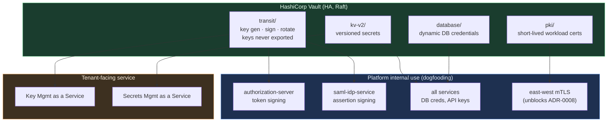
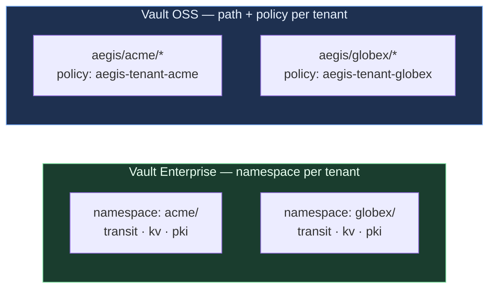
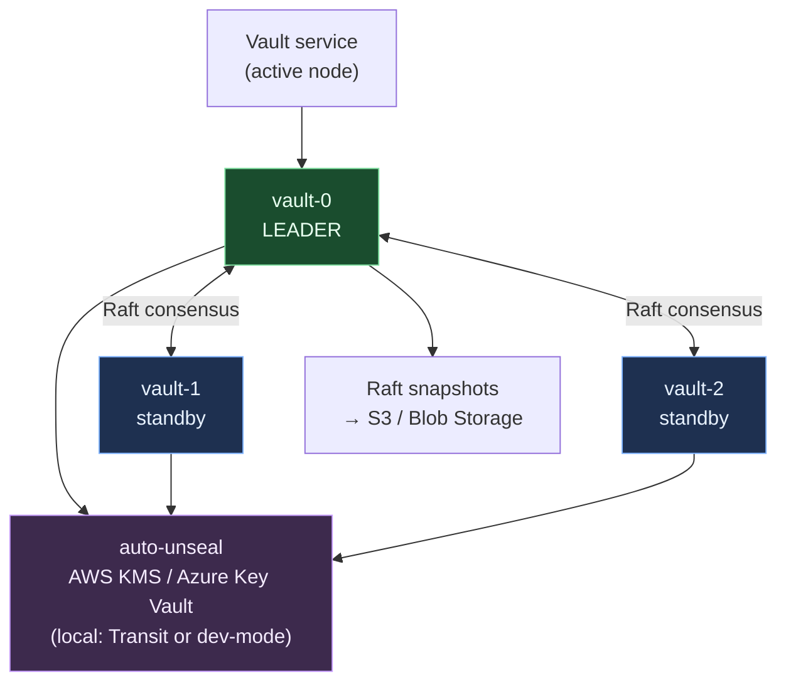
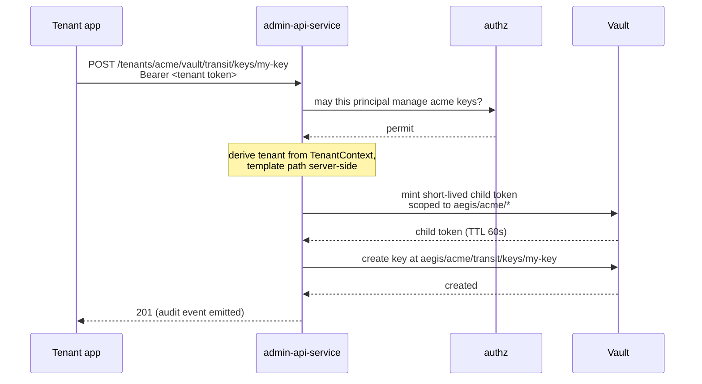

# Aegis — HashiCorp Vault Architecture

> **Status:** specification (SDD). Written 2026-08-26 ahead of implementation. Decisions recorded in
> **ADR-0015** (Vault as the per-tenant key & secret substrate — *supersedes the key-wrapping
> mechanism of ADR-0007*) and **ADR-0016** (HA everywhere + tenant-facing service).

---

## 1. Why Vault, and what it replaces

ADR-0007 wrapped per-tenant signing keys using **cloud KMS envelope encryption**: the private key was
encrypted at rest by AWS KMS or Azure Key Vault, unwrapped on demand, and briefly cached in
application memory. That was a reasonable v1. Three problems surfaced:

1. **It is cloud-specific.** AWS and Azure deployments diverge exactly where they must not — on the
   token-signing path. Two code paths, two failure modes, two sets of IAM semantics.
2. **Local development has no faithful equivalent.** The most security-critical path in the platform
   became the least-tested one, because developers ran a stubbed key store.
3. **It cannot be offered *to* tenants**, only used on their behalf. Tenants of an identity platform
   ask for managed secrets and managed keys constantly, and the platform already operates exactly
   that machinery.

Vault addresses all three with one substrate, and improves the security property while doing it.

> **The strict improvement worth naming.** Under ADR-0007 the private key was *unwrapped into
> application memory* and cached. Under Vault Transit the private key **never leaves Vault at all** —
> the application sends bytes to be signed and receives a signature. A memory-disclosure bug in a
> Spring service can no longer yield a tenant's signing key, because the key was never there.

| | ADR-0007 (KMS envelope) | **ADR-0015 (Vault)** |
|---|---|---|
| Private key in app memory | yes, briefly | **never** |
| Local == prod path | no | **yes** |
| AWS == Azure path | no | **yes** |
| Offerable to tenants | no | **yes** |
| Per-tenant crypto isolation | by convention | **by namespace/policy** |
| Cloud KMS role | app dependency | **Vault auto-unseal only** |

---

## 2. Engines and what each is for



| Engine | Platform-internal use | Tenant-facing use |
|---|---|---|
| **transit** | Per-tenant JWT signing keys; SAML assertion signing | Sign/verify/encrypt/decrypt with tenant-owned keys |
| **kv-v2** | Service secrets, connector credentials | Tenant application secrets, versioned |
| **pki** | Short-lived east-west workload certs (mTLS) | Per-tenant private CA, device/workload certs |
| **database** | Dynamic, short-TTL Postgres credentials | *(not exposed initially)* |

### 2.1 The platform uses what it sells — explicitly

This is a deliberate architectural commitment, not an accident of implementation (ADR-0016):

> **Aegis's own signing keys, service secrets and workload certificates come from the same Vault
> engines, through the same client code, as the tenant-facing offering.**

The value is not aesthetic. It means a tenant-facing bug surfaces **internally first**, on the
platform's own token path, where it is noticed immediately. Any code path that only tenants exercise
is a code path nobody is watching.

---

## 3. Per-tenant isolation — the base of the platform

Multi-tenancy is the platform's foundation (ADR-0006), so Vault isolation is per tenant, with two
implementations selected by configuration so **application code is identical either way**:



**Path convention (OSS) — one shared mount per engine:**

```
aegis/transit/keys/{tenant}-{purpose}      # purpose: token-signing | saml-signing | tenant-managed-*
aegis/transit/sign/{tenant}-{purpose}
aegis/kv/data/{tenant}/{path}
aegis/pki/issue/{tenant}-{role}
```

> **Why the tenant is a name *prefix* for transit but a path *segment* for KV.** A transit key name
> is a single URL path segment and cannot contain `/`, so the tenant has to be part of the name. KV
> v2 genuinely supports nested paths, so there it is a segment.
>
> The intuitive alternative — a mount per tenant, `aegis/{tenant}/transit/…` — is a **scaling dead
> end**. Vault caps mounts at roughly **14,000** on Integrated Storage, and every additional mount
> lengthens leadership transfer, so per-tenant mounts put a hard ceiling on tenant count and degrade
> failover long before that ceiling is reached. Isolation comes instead from per-tenant policies
> globbing the prefix (`path "aegis/transit/keys/acme-*"`), which costs nothing and scales.

**Non-negotiable, and enforced by a mandatory negative test:** the `{tenant}` segment is **always**
derived server-side from `TenantContext` and templated into the path. A tenant-supplied path string
never reaches Vault. This is the same rule as `X-Aegis-Tenant` at the edge (ADR-0008) — tenant
identity is *derived*, never *accepted*.

Generated per-tenant policy:

```hcl
# policy: aegis-tenant-acme
path "aegis/transit/keys/acme-tenant-managed-*"   { capabilities = ["create","read","update","list"] }
path "aegis/transit/sign/acme-tenant-managed-*"   { capabilities = ["update"] }
path "aegis/transit/verify/acme-tenant-managed-*" { capabilities = ["update"] }
path "aegis/kv/data/acme/*"                       { capabilities = ["create","read","update","delete","list"] }
# platform-internal keys are NOT reachable by the tenant token:
path "aegis/transit/keys/acme-token-signing"      { capabilities = ["deny"] }
path "aegis/transit/sign/acme-token-signing"      { capabilities = ["deny"] }
```

Note the final rule: a tenant can manage *its own* keys but can never touch the key Aegis uses to
sign that tenant's tokens. Those live in the same namespace but are policy-fenced apart.

---

## 4. High availability

Vault becomes a **tier-0 dependency on the token path** (ADR-0015), so a single node is unacceptable
in *any* topology — including local, or the dev environment stops predicting production.



| Topology | Nodes | Storage | Auto-unseal |
|---|---|---|---|
| **Local** (Docker Compose) | 3 (Raft) | integrated | dev-mode / Transit seal |
| **AWS** (EKS, Helm) | 3–5 (Raft) | integrated + EBS | **AWS KMS** |
| **Azure** (AKS, Helm) | 3–5 (Raft) | integrated + Managed Disk | **Azure Key Vault** |

Cloud KMS is thereby **demoted**: it no longer sits on the request path, it only unseals Vault at
startup. A KMS outage after unseal does not stop token signing.

### 4.1 Degraded mode — stated honestly

Making Vault tier-0 means being explicit about what happens when it is unavailable:

| Vault state | Token **verification** | Token **signing** |
|---|---|---|
| Healthy | works | works |
| Unreachable, keys cached | **works** (public JWKS cached) | **fails closed** |
| Unreachable, cold cache | fails | fails closed |

Signing **fails closed** — never falls back to a locally-held key, because a fallback key is exactly
the long-lived in-memory secret this design exists to eliminate. Verification degrades gracefully
because public material is cacheable and non-sensitive. The existing aggregate-JWKS caching already
provides this property.

---

## 5. Vault as a tenant-facing service

Exposed through `admin-api-service` at `/api/v1/tenants/{id}/vault/**`, **brokered**:



**Tenants never receive a raw Vault token.** The platform mints a short-lived, path-scoped child
token per request and discards it. This keeps the blast radius of a leaked response at ~60 seconds
and one tenant's path prefix.

### 5.1 API surface

| Method | Path | Purpose |
|---|---|---|
| `POST` | `/vault/transit/keys/{name}` | Generate a key (never exportable by default) |
| `POST` | `/vault/transit/sign/{name}` | Sign a digest |
| `POST` | `/vault/transit/verify/{name}` | Verify a signature |
| `POST` | `/vault/transit/encrypt/{name}` | Encrypt (data never persisted by Vault) |
| `POST` | `/vault/transit/rotate/{name}` | Rotate; prior versions still verify |
| `GET/PUT/DELETE` | `/vault/kv/{path}` | Versioned secret CRUD |
| `POST` | `/vault/pki/issue/{role}` | Issue a short-lived certificate |

Every call emits an `AuditEvent` (`type=vault`) carrying key **name and version — never key
material, never plaintext, never the secret value**, per the platform's standing non-negotiable.

---

## 6. Usage

### 6.1 Local

```bash
cd aegis-platform-infra/compose
docker compose up vault-0 vault-1 vault-2 vault-init
export VAULT_ADDR=http://localhost:8200
vault status          # 3 nodes, one leader
```

`vault-init` bootstraps: enables `transit`, `kv-v2` and `pki`, creates the `aegis/` mounts, applies
per-tenant policies for the seeded demo tenants, and writes an AppRole for each service.

### 6.2 From a service

Services depend on `aegis-vault-commons` and never talk to Vault's HTTP API directly:

```java
// signing — the private key never leaves Vault
byte[] signature = transit.sign("token-signing", digest);   // tenant derived from TenantContext

// secrets
String dbPassword = secrets.get("datasource/password");

// key generation, exposed to tenants
transit.createKey("tenant-managed/my-key", KeyType.RSA_4096);
```

`TenantContext` supplies the tenant segment. There is no overload that accepts a tenant argument —
the only way to reach another tenant's path is to change `TenantContext`, which the filter controls.

### 6.3 Configuration

```yaml
aegis:
  vault:
    enabled: true
    uri: https://vault.aegis.svc:8200
    isolation: PATH          # PATH (OSS) | NAMESPACE (Enterprise)
    mount: aegis
    auth: KUBERNETES         # KUBERNETES | APPROLE | TOKEN (dev only)
    transit:
      tokenSigningKey: token-signing
      cacheTtl: PT5M         # public material only
```

---

## 7. Migration from ADR-0007

Rotation-based, no downtime, no token invalidation — the existing overlapping-`kid` rotation design
(ADR-0007) is precisely what makes this safe:

1. Deploy Vault HA; enable engines; keep KMS path active.
2. For each tenant, generate a **new** Transit key and publish its `kid` to JWKS **without signing**.
3. Flip signing to the Vault `kid`. The old KMS `kid` remains in JWKS and stays verifiable.
4. When every token signed by the old `kid` has expired, retire it and destroy the KMS key.

Step 2→3 is reversible; step 4 is the point of no return, gated on TTL expiry rather than on a clock.

---

## 8. Build status

Updated 2026-08-26 after the first implementation pass.

| Item | Status |
|---|---|
| ADR-0015, ADR-0016 | **Accepted** |
| This specification | **Written** |
| `aegis-vault-commons` (transit, KV v2, PKI paths) | **Built** — 30/30 unit tests |
| `TenantVaultPaths` traversal/injection defences | **Built** — 10 hostile inputs covered |
| Compose HA (3-node Raft) + bootstrap | **Built** — `docker compose config` validates |
| Helm values (EKS + AKS) | **Built** — placeholders filled from Terraform outputs |
| Terraform unseal modules (AWS + Azure) | **Built** — `terraform fmt` clean |
| **AS migration off KMS onto Vault Transit** | **Built, behind a flag** — `VaultJwtEncoder` + `VaultTenantSigner` sign via Transit and the JWKS endpoint publishes both key sets during overlap. Set `aegis.vault.signing.enabled=true` to cut over; default off so §7 stays reversible |
| Tenant-facing Vault broker API | **NOT started** — specified in §5, no endpoint yet |

**The honest headline:** the signing path now exists and is tested — `VaultJwtEncoder` assembles the
JWS locally and sends only the *signing input* to Vault, so no private key enters the process. It is
**off by default**, because §7 is a rotation: the new `kid` must appear in JWKS before it signs, and
the old KMS `kid` must stay verifiable until its tokens expire. The flag is what makes those steps
separable and the cutover reversible. ADR-0015's claim becomes true of a given environment the moment
that environment sets `aegis.vault.signing.enabled=true`.
